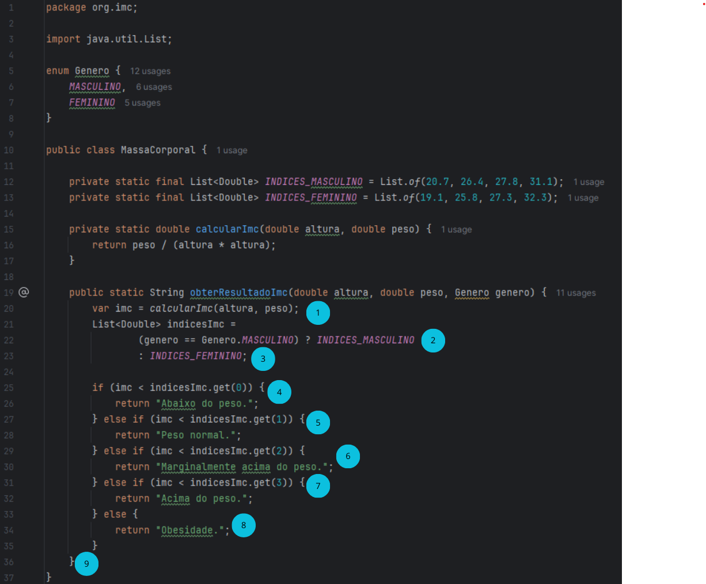
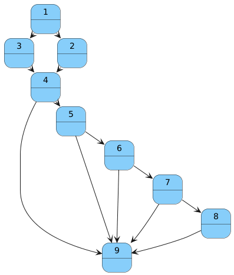

# Massa Corporal

Cálculo de IMC e resultado na tabela para os sexos Masculino e Feminino.

| Condição                    | IMC em Mulheres              | IMC em Homens                |
|-----------------------------| ---------------------------- | ---------------------------- |
| Abaixo do peso              | imc < 19,1                   | imc < 20,7                   |
| Peso normal                 | 19,1 <= imc < 25,8           | 20,7 <= imc < 26,4           |
| Marginalmente acima do peso | 25,8 <= imc < 27,3          | 26,4 <= imc < 27,8           |
| Acima do peso ideal         | 27,3 <= imc < 32,3           | 27,8 <= imc < 31,1           |
| Obesidade                   | imc >= 32,3                  | imc >= 31,1                  |

Complexidade ciclomática:

  
  

